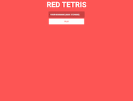
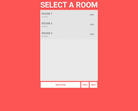
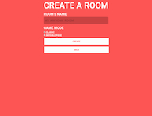
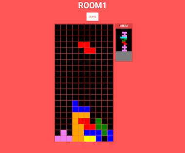

# Red Tetris

An online multiplayer game




	

### Development Mode

#### Launch Server

```
$ npm run  srv-dev
> red_tetrisboilerplate@0.0.1 srv-dev /home/zadrien/JS/red_tetris
> DEBUG=tetris:* nodemon src/server/start.js
```
N.B: You'll need an NoSQL Database to run the server properly (you can configure it with the `params.js` file).

#### Launch Client

```
$ npm run client-dev
> red_tetrisboilerplate@0.0.1 client-dev /home/zadrien/JS/red_tetris
> react-scripts start
```


Point your browser to `http://0.0.0.0:8080/` it will load client side application. You should see `Soon, will be here a fantastic Tetris ...`, open your console and check you have :

```
[HMR] Waiting for update signal from WDS...
bundle.js:28328  action @ 14:29:58.602 ALERT_POP 
bundle.js:28340  prev state Object
bundle.js:28344  action Object
bundle.js:28352  next state Object
bundle.js:616 [WDS] Hot Module Replacement enabled.
```

URL is not yet editable in `params.js`, change it directly inside `package.json`.

#### Test

Test, test and re-test …

Stop server, or use an other setup (//TODO)
```
$ npm run test
```